# Docker Infrastructure

Each product is packaged as its own `docker-compose.*.yml` under `ai/` and can be started independently. Every container is attached to a shared external Docker network (`ai_shared`) so services resolve each other by container name (e.g. `http://litellm:4000`, `http://vllm-qwen-vl:8000`).

## Shared Docker network

Create it once before starting any compose file:

```bash
docker network create ai_shared
```

Or via make:

```bash
make network
```

The `make setup` target creates the network automatically.

## Compose files

Every service in the list below is on the `ai_shared` network unless noted. Ports shown are the **host** ports the container publishes (sourced from `.env` — the values in the table are the documented defaults).

| Compose file | Service(s) | Host port | README |
|---|---|---|---|
| [`docker-compose.yml`](docker-compose.yml) | _(none — just declares the external `ai_shared` network)_ | — | — |
| [`litellm/docker-compose.litellm.yml`](litellm/docker-compose.litellm.yml) | `litellm`, `litellm_db`, `prometheus` | `4001`, `5432`, `9090` | [LITELLM.md](litellm/LITELLM.md) · [LITELLM_MCP.md](litellm/LITELLM_MCP.md) |
| [`openwebui/docker-compose.openwebui.yml`](openwebui/docker-compose.openwebui.yml) | `openwebui` | `8007` | [OPENWEBUI.md](openwebui/OPENWEBUI.md) |
| [`oauth2-proxy/docker-compose.oauth2-proxy.yml`](oauth2-proxy/docker-compose.oauth2-proxy.yml) | `oauth2-proxy`, `oauth2-assets` | `4180` _(oauth2-assets is internal-only)_ | [OAUTH2_PROXY.md](oauth2-proxy/OAUTH2_PROXY.md) |
| [`cloudflared/docker-compose.cloudflared.yml`](cloudflared/docker-compose.cloudflared.yml) | `cloudflared` | _(outbound tunnel — no publish)_ | [CLOUDFLARED.md](cloudflared/CLOUDFLARED.md) |
| [`vllm/docker-compose.vllm.yml`](vllm/docker-compose.vllm.yml) | `vllm-qwen`, `vllm-qwen-vl` | `8002`, `8006` | [VLLM.md](vllm/VLLM.md) · [GPU_SHARING_GUIDE.md](GPU_SHARING_GUIDE.md) |
| [`llama/docker-compose.llama.yml`](llama/docker-compose.llama.yml) | `glm5.2` | `8010` | [LLAMA.md](llama/LLAMA.md) |
| [`kokoro/docker-compose.kokoro.yml`](kokoro/docker-compose.kokoro.yml) | `kokoro-api`, `kokoro-app` (internal) | `8004` | [KOKORO.md](kokoro/KOKORO.md) |
| [`madlad/docker-compose.madlad.yml`](madlad/docker-compose.madlad.yml) | `madlad-api`, `madlad-app` (internal) | `8008` | [MADLAD.md](madlad/MADLAD.md) |
| [`classifier/docker-compose.classifier.yml`](classifier/docker-compose.classifier.yml) | `classifier` | `8005` | [classifier/API.md](classifier/API.md) |
| [`unsloth/docker-compose.unsloth.yml`](unsloth/docker-compose.unsloth.yml) | `unsloth` | `8000` (model — LiteLLM upstream), `8888` (Jupyter), `22` (SSH) | [UNSLOTH.md](unsloth/UNSLOTH.md) |
| [`roofix/docker-compose.roofix.yml`](roofix/docker-compose.roofix.yml) | `roofix` | _(internal only)_ | [ROOFIX.md](roofix/ROOFIX.md) |
| [`interceptor/docker-compose.interceptor.yml`](interceptor/docker-compose.interceptor.yml) | `interceptor` | _(internal only)_ | [INTERCEPTOR.md](interceptor/INTERCEPTOR.md) |
| [`searxng/docker-compose.searxng.yml`](searxng/docker-compose.searxng.yml) | `searxng` | `8009` | [SEARXNG.md](searxng/SEARXNG.md) |
| [`sandbox/docker-compose.sandbox.yml`](sandbox/docker-compose.sandbox.yml) | `sandbox-runner`, `sandbox-proxy`, `sandbox-egress`, `sandbox-db` | `8012` (runner), `8011` (proxy), `5434` (db) | [SANDBOX.md](sandbox/SANDBOX.md) |
| [`n8n/docker-compose.n8n.yml`](n8n/docker-compose.n8n.yml) | `n8n`, `n8n-db` | `5435` (db) — n8n itself reached via oauth2-proxy at `/n8n/` | [N8N.md](n8n/N8N.md) |
| [`trino/docker-compose.trino.yml`](trino/docker-compose.trino.yml) | `trino-coordinator`, `hive-metastore`, `hive-metastore-db`, `minio`, `minio-init`, `trino-mcp`, `superset`, `superset-db` | `8013` (trino), `8014`/`8015` (minio api/console), `8016` (superset), `5436`/`5437` (hms-db / superset-db) — minio-console and superset also reached via oauth2-proxy at `/minio/` and `/superset/` | [TRINO.md](trino/TRINO.md) |

## Flow diagram

Solid arrows are runtime request paths; dotted arrows are auxiliary (metrics scraping, model-weight downloads, OAuth callbacks). Node → README links live in the [Compose files](#compose-files) table above.

```mermaid
flowchart TB
    classDef ext fill:#f5f5f5,stroke:#999,color:#333
    classDef svc fill:#e8f0fe,stroke:#4a86e8,color:#1a1a1a
    classDef store fill:#fff4d6,stroke:#e8a33d,color:#1a1a1a
    classDef standalone fill:#f3e8fd,stroke:#8e63ce,color:#1a1a1a

    Browser["Browser<br/>chat.zeoenergy.com"]:::ext
    Google["Google OAuth<br/>+ Directory API"]:::ext
    HF["HuggingFace Hub<br/>model weights"]:::ext
    CC["Claude Code / API clients<br/>localhost:4001"]:::ext
    Gmail["Gmail<br/>(roofix@zeoenergy.com)"]:::ext
    GmailMCP["gmail-mcp<br/>(external)"]:::ext
    PhoenixMCP["phoenix-mcp.com<br/>(external MCP)"]:::ext
    Roofix["roofix.io<br/>(Bubble app)"]:::ext
    ExtSite["target sites<br/>(any URL)"]:::ext
    SearchEngines["upstream search engines<br/>Google, Bing, DuckDuckGo, …"]:::ext

    subgraph CFG["cloudflared/docker-compose.cloudflared.yml"]
        CF["cloudflared<br/>tunnel"]:::svc
    end
    subgraph O2PG["oauth2-proxy/docker-compose.oauth2-proxy.yml"]
        O2P["oauth2-proxy<br/>:4180"]:::svc
        OA["oauth2-assets<br/>nginx internal :80<br/>serves ../assets/"]:::svc
    end
    subgraph OWUG["openwebui/docker-compose.openwebui.yml"]
        OWU["openwebui<br/>:8007"]:::svc
    end
    subgraph LLG["litellm/docker-compose.litellm.yml"]
        LL["litellm<br/>:4001"]:::svc
        DB[("litellm_db<br/>postgres :5432")]:::store
        PROM["prometheus<br/>:9090"]:::svc
    end
    subgraph VG["vllm/docker-compose.vllm.yml"]
        VQ["vllm-qwen<br/>:8002<br/>Qwen3.6-35B-A3B"]:::svc
        VQVL["vllm-qwen-vl<br/>:8006<br/>Qwen2.5-VL-7B"]:::svc
    end
    subgraph LMG["llama/docker-compose.llama.yml"]
        LGLM["glm5.2<br/>:8010<br/>GLM-5.2 UD-IQ1_S<br/>(llama.cpp + CPU MoE offload)"]:::svc
    end
    subgraph KG["kokoro/docker-compose.kokoro.yml"]
        KAPI["kokoro-api<br/>:8004"]:::svc
        KAPP["kokoro-app<br/>internal"]:::svc
    end
    subgraph MG["madlad/docker-compose.madlad.yml"]
        MAPI["madlad-api<br/>:8008"]:::svc
        MAPP["madlad-app<br/>internal"]:::svc
    end
    subgraph CLG["classifier/docker-compose.classifier.yml"]
        CLS["classifier<br/>:8005"]:::svc
        CLSDB[("classifier.db<br/>sqlite (job store)")]:::store
    end
    subgraph UG["unsloth/docker-compose.unsloth.yml"]
        UN["unsloth<br/>model :8000 (llama.cpp)<br/>Jupyter :8888 / SSH :22"]:::svc
    end
    subgraph RXG["roofix/docker-compose.roofix.yml"]
        RB["roofix<br/>internal :8080"]:::svc
    end
    subgraph IAG["interceptor/docker-compose.interceptor.yml"]
        IA["interceptor<br/>internal :8080"]:::svc
    end
    subgraph SXG["searxng/docker-compose.searxng.yml"]
        SX["searxng<br/>:8009"]:::svc
    end
    subgraph SBG["sandbox/docker-compose.sandbox.yml<br/>(network-segmented)"]
        SBR["sandbox-runner<br/>:8012<br/>FastAPI + MCP + docker.sock"]:::svc
        SBP["sandbox-proxy<br/>:8011<br/>Caddy /{id}/*"]:::svc
        SBE["sandbox-egress<br/>internal<br/>tinyproxy allowlist"]:::svc
        SBD[("sandbox-db<br/>postgres :5434<br/>sandbox_state net")]:::store
        SBX["sandbox-{id}<br/>ephemeral<br/>sandbox_net only"]:::standalone
    end
    subgraph N8NG["n8n/docker-compose.n8n.yml"]
        N8N["n8n<br/>:5678 internal<br/>(via /n8n/)"]:::svc
        N8NDB[("n8n-db<br/>postgres :5435")]:::store
    end
    subgraph TRG["trino/docker-compose.trino.yml"]
        TR["trino-coordinator<br/>:8013<br/>(federated SQL)"]:::svc
        HMS["hive-metastore<br/>thrift :9083 internal"]:::svc
        HMSDB[("hive-metastore-db<br/>postgres :5436<br/>analytics_net")]:::store
        MINIO[("minio<br/>api :8014 / console :8015<br/>iceberg warehouse")]:::store
        TMCP["trino-mcp<br/>internal :8080<br/>SELECT-only shim"]:::svc
        SS["superset<br/>:8016 (via /superset/)"]:::svc
        SSDB[("superset-db<br/>postgres :5437<br/>analytics_net")]:::store
    end

    Browser --> CF --> O2P --> OWU
    O2P -->|"/assets/* (skip-auth)"| OA
    O2P -. OAuth + group check .-> Google
    OWU  ==>|OpenAI API<br/>via ai_shared| LL
    CC   ==>|OpenAI API| LL

    LL ==>|"model pass-through<br/>qwen3.6-unsloth"| UN
    LL ==> VQ
    LL ==> VQVL
    LL ==> LGLM
    LL ==>|"/v1/audio/speech"| KAPI
    LL ==>|"/v1/madlad/* + MCP tool"| MAPI
    LL ==>|"/v1/classifier/*"| CLS
    LL --> DB
    PROM -. scrape .-> LL

    KAPI --> KAPP
    MAPI --> MAPP
    CLS  -->|VLLM_QWEN_VL_API| VQVL
    CLS  --> CLSDB

    RB   ==>|OpenAI SDK<br/>brain fallback| LL
    RB   ==>|"HTTP<br/>/capture"| IA
    RB   -->|"MCP JSON-RPC"| GmailMCP
    RB   -->|"MCP JSON-RPC"| PhoenixMCP
    LL   -.->|MCP registration| GmailMCP
    LL   -.->|MCP registration| PhoenixMCP
    LL   -.->|MCP registration| IA
    LL   ==>|"/v1/interceptor/*"| IA
    GmailMCP -. IMAP/API .-> Gmail
    IA   -. CDP .-> ExtSite
    IA   -. CDP .-> Roofix

    OWU  ==>|"web search"| SX
    SX   -. HTTPS .-> SearchEngines

    LL   -.->|MCP registration| SBR
    O2P  ==>|"/sandboxes/{id}/*<br/>(same-origin cookie)"| SBP
    SBP  -->|"sandbox_net"| SBX
    SBR  -->|"docker.sock<br/>spawn/reap"| SBX
    SBR  -->|"sql (sandbox_state)"| SBD
    SBX  -->|"HTTP_PROXY"| SBE
    SBE  -. allowlisted HTTPS .-> HF

    O2P  ==>|"/n8n/*<br/>(same-origin cookie)"| N8N
    N8N  ==>|"OpenAI SDK<br/>AI + LangChain nodes"| LL
    N8N  --> N8NDB

    LL   -.->|MCP registration| TMCP
    TMCP ==>|"trino DBAPI<br/>SELECT-only"| TR
    O2P  ==>|"/superset/*<br/>(same-origin cookie)"| SS
    O2P  ==>|"/minio/*<br/>(same-origin cookie)"| MINIO
    SS   ==>|"sqlalchemy-trino"| TR
    SS   --> SSDB
    TR   -->|"thrift 9083<br/>analytics_net"| HMS
    HMS  --> HMSDB
    TR   -->|"s3 API<br/>iceberg parquet"| MINIO
    HMS  -.->|"s3a validation"| MINIO
    TR   -.->|"federated<br/>host publish :5432"| DB
    TR   -.->|"federated<br/>ai_shared"| RB
    TR   -.->|"federated<br/>host publish :5434"| SBD

    KAPP -. model download .-> HF
    MAPP -. model download .-> HF
    VQ   -. model download .-> HF
    VQVL -. model download .-> HF
    LGLM -. GGUF download .-> HF
```



### Reading the diagram

- **Public entry point** — only `cloudflared` receives inbound traffic from outside the LAN. Every request to `chat.zeoenergy.com` transits `cloudflared → oauth2-proxy → openwebui`, except `/assets/*` which oauth2-proxy short-circuits to the internal `oauth2-assets` nginx sidecar without requiring a session (used to load the branded logo on the pre-auth sign-in and error pages — see [OAUTH2_PROXY.md § Branded sign-in and error pages](oauth2-proxy/OAUTH2_PROXY.md#branded-sign-in-and-error-pages)).
- **Exactly one tunnel connector** — `cloudflared` must be the only connector registered for the tunnel on this host. Cloudflare load-balances across every registered connector, so a leftover host-level `cloudflared.service` serving the same tunnel id makes roughly half of all requests return 502 while the rest succeed — an intermittent failure that looks like a Cloudflare outage. Resetting the tunnel token rotates the secret on the existing tunnel; it does **not** create a new one and does **not** evict a duplicate connector. See [CLOUDFLARED.md § Exactly one connector per tunnel](cloudflared/CLOUDFLARED.md#exactly-one-connector-per-tunnel).
- **Tunnel ingress origins are container-relative** — ingress rules live in the Cloudflare dashboard, not this repo, and are dialed from inside the `cloudflared` container, where `localhost` is the container itself. A container-hosted target uses its **container** port on the service name (`http://litellm:4000`, not the published `localhost:4001`); a host-hosted target uses `host.docker.internal`, which resolves only because the compose file declares `extra_hosts: host.docker.internal:host-gateway`. See [CLOUDFLARED.md § Origin addresses are container-relative](cloudflared/CLOUDFLARED.md#origin-addresses-are-container-relative).
- **Fan-out from LiteLLM** — LiteLLM is the single OpenAI-compatible surface. Chat models are served by vLLM and Unsloth (llama.cpp); TTS by Kokoro; translation by MADLAD; image-quality by the classifier. Open WebUI and any external Claude Code / API client both hit LiteLLM the same way.
- **Two-container app/api pattern** — Kokoro and MADLAD each split into an internal `-app` (model on GPU, blocking) and a `-api` proxy (stateless, non-blocking). Only the `-api` half is published to the host.
- **Classifier ↔ vLLM** — the classifier is a vLLM client, not a peer; it calls `vllm-qwen-vl` internally for LLM scoring. Its own SQLite job store (`classifier.db` on the `classifier_data` volume) persists async `/assess` job state so callers can poll `GET /jobs/{id}` across restarts.
- **Unsloth dual role** — the CUDA-compiled llama.cpp binary serves a chat model at `unsloth:8000` (routed via LiteLLM as the `qwen3.6-unsloth` model entry sourced from `DEFAULT_LITELLM_MODEL_API_BASE`), while Jupyter (`:8888`) and SSH (`:22`) remain available for training / fine-tuning workflows.
- **llama.cpp stack for oversize models** — `llama/docker-compose.llama.yml` runs `ghcr.io/ggml-org/llama.cpp:server-cuda` for models that don't fit any vLLM-supported precision. The initial inhabitant is `glm5.2` (Z.ai GLM-5.2, 753B-A40B MoE) at UD-IQ1_S (~176 GB), which does not fit in 3× A6000 VRAM alone — `--n-cpu-moe` offloads expert layers into system RAM. Weights auto-download via `-hf` into the `llama_data` named volume on first start. Unlike Unsloth's mixed-purpose container, this stack is inference-only; add new models by copying the commented template block in the compose file. See [LLAMA.md](llama/LLAMA.md) for quant sizing tables and the `--n-cpu-moe` tuning loop.
- **Roofix bridge** — packaged in `roofix/docker-compose.roofix.yml`. Internal worker; does NOT receive inbound traffic. APScheduler ticks every `TICK_INTERVAL_SECONDS` (default 300s); each tick fetches unread Roofix mail via the Gmail MCP, decides per-event (rules first, LiteLLM fallback), and writes back via the Phoenix MCP. Ambiguous email events trigger a proposal fetch via `RoofixScraperClient` (`ai/roofix/components/roofix_scraper_client.py`), which POSTs to `interceptor`'s `/capture` under the `roofix` named profile. The old `roofix-scraper` service was retired — proposal captures now share the generic `interceptor` container with any other logged-in-site capture use case. Operators refresh the Roofix session by uploading a captured Chrome user-data-dir to `interceptor`'s `/profiles/roofix/refresh` (see [INTERCEPTOR.md](interceptor/INTERCEPTOR.md)).
- **Gmail MCP is a passthrough, not a proxied identity** — the `LL -.-> GmailMCP` edge uses LiteLLM's `delegate_auth_to_upstream: true` mode. LiteLLM only advertises the endpoint; the OAuth 2.1 flow runs end-to-end between Open WebUI and `gmailmcp.googleapis.com` per user, and LiteLLM forwards the resulting `Authorization: Bearer` header untouched. Users must enable the Gmail tool per-chat (it cannot be a default-enabled tool on a model, because the OAuth browser redirect cannot happen mid-completion).
- **Interceptor API is a generic CDP capture service** — `interceptor` wraps `common.cdp_interceptor` behind an HTTP + MCP surface. Callers pass a URL and a list of URL regex patterns; the service navigates a headless Chrome under a named `--user-data-dir` and returns the JSON XHR/fetch bodies whose URLs matched. LiteLLM exposes it both as an MCP tool (`interceptor.capture_url`) and as a `/v1/interceptor/*` pass-through. Auth is per-profile: operators refresh a profile by uploading a `.tgz` of a captured Chrome user-data-dir to `POST /profiles/{name}/refresh`. Concurrent captures are serialized (409 on collision) because a single container binds one CDP debug port.
- **SearXNG is Open WebUI's web-search backend, not LiteLLM's** — when a user toggles web search on in the chat composer, Open WebUI calls `http://searxng:8080/search?format=json` server-side, injects the top-N results into the prompt, and only *then* dispatches to LiteLLM. Models never call SearXNG directly, and it is not registered as an MCP tool. SearXNG fans out to public search engines (Google, Bing, DuckDuckGo, …) with no API key of its own — see [SEARXNG.md](searxng/SEARXNG.md).
- **Sandbox subsystem is deliberately off `ai_shared`** — unlike every other product, the sandbox stack (`sandbox-runner`, `sandbox-proxy`, `sandbox-egress`, `sandbox-db`, and every spawned `sandbox-{id}` container) runs on two additional Docker networks: `sandbox_net` (bridge, `internal: true`) and `sandbox_state` (bridge, `internal: true`). Because the model-generated code inside a sandbox is untrusted, sandboxes MUST NOT be able to reach `litellm`, `phoenix-mcp`, `roofix-db`, `interceptor`, etc. `sandbox-runner` is the only container that straddles all three networks — it's the audit boundary and the single privileged consumer of `/var/run/docker.sock`. `sandbox-proxy` (Caddy) bridges `ai_shared → sandbox_net` so Open WebUI can iframe `http://sandbox-proxy/{id}/`. Outbound HTTP from sandboxes is forced through `sandbox-egress` (tinyproxy) with a hard-coded destination allowlist (pypi, npmjs, esm.sh, jsdelivr) — everything else drops. `sandbox-db` sits on `sandbox_state` alone so a container-escape in a sandbox cannot tamper with the job store. See [SANDBOX.md](sandbox/SANDBOX.md) for the security-invariant checklist that must be re-verified on every change to the subsystem.
- **Sandbox iframes share the Open WebUI origin** — the iframe `src` returned by `preview_app` is `https://chat.zeoenergy.com/sandboxes/{id}/`, not `http://sandbox-proxy/{id}/`. `oauth2-proxy` has `http://sandbox-proxy:80/sandboxes/` in `OAUTH2_PROXY_UPSTREAMS`, so `chat.zeoenergy.com/sandboxes/*` gets fanned out to sandbox-proxy alongside `chat.zeoenergy.com/*` (openwebui) and `chat.zeoenergy.com/assets/*` (branded sign-in assets). Because the sandbox iframe is same-origin with the chat, the `_oauth2_proxy` cookie is sent automatically — no separate sign-in, no cross-origin CSP surprise. `/sandboxes/*` is NOT in `OAUTH2_PROXY_SKIP_AUTH_ROUTES`, so anonymous requests are still gated. See [SANDBOX.md § Public iframe routing](sandbox/SANDBOX.md#public-iframe-routing) for the traffic-path diagram and how to move to a separate `sandboxes.` subdomain if you want to serve unauthenticated previews.
- **Trino data lake bridges `ai_shared` and `analytics_net`** — Trino coordinator, MinIO (API + console), Superset, and `trino-mcp` sit on `ai_shared` so LiteLLM / OpenWebUI / laptops can reach them. The data plane (HMS ↔ HMS-Postgres ↔ Superset-Postgres) lives on `analytics_net` alone. Model-facing SQL flows `LiteLLM → trino-mcp → trino-coordinator`; humans go `oauth2-proxy → superset → trino-coordinator`. The `TR -.-> DB`, `TR -.-> RB`, `TR -.-> SBD` edges are federation reads issued via Trino — dashed because they cross subsystem boundaries. `litellm_db` and `sandbox-db` are reached via `host.docker.internal` on the host publish (they aren't on `ai_shared`) so Trino doesn't have to join `litellm`'s `internal` network or breach `sandbox_state` isolation; `roofix-db` is on `ai_shared` and uses service DNS. `trino-mcp` is SELECT-only — `common.trino.TrinoClient` rejects DDL/DML, spliced `LIMIT` caps result rows at `TRINO_MCP_MAX_ROWS`, and `query_max_execution_time` in session properties caps runtime at `TRINO_MCP_MAX_RUNTIME_S`. Superset uses `AUTH_TYPE=AUTH_REMOTE_USER` (trusts the `X-Auth-Request-Email` header from oauth2-proxy) — the host publish on `PORT_SUPERSET` MUST be loopback-bound or dropped before running on an untrusted network, or anyone on the LAN can spoof the header. See [TRINO.md](trino/TRINO.md) for the operator guide.
- **n8n rides on the same shared hostname under `/n8n/`** — same trick as `/sandboxes/*`, one more entry (`http://n8n:5678/n8n/`) in `OAUTH2_PROXY_UPSTREAMS`. On the n8n side, `N8N_PATH=/n8n/` + `N8N_EDITOR_BASE_URL=https://chat.zeoenergy.com/n8n/` + `WEBHOOK_URL=https://chat.zeoenergy.com/n8n/` (all set in `ai/n8n/docker-compose.n8n.yml`) make the editor's HTML and outbound webhook payloads use the subpath-aware URL. The shared oauth2-proxy cookie means one Google sign-in covers both Open WebUI and n8n; **no Cloudflare tunnel change is needed** because it's the same hostname. n8n's AI / LangChain nodes are preconfigured to talk to LiteLLM (`http://litellm:4000/v1` + `DEFAULT_LITELLM_MASTER_KEY`) so workflows don't need per-credential base-URL entry. Workflow rows, credential blobs, and execution history live in the dedicated `n8n-db` Postgres (`:5435`); credentials are encrypted at rest with `N8N_ENCRYPTION_KEY`, which is load-bearing across restarts — see [N8N.md](n8n/N8N.md).

## Ports at a glance

Ports are sourced from `.env` (`PORT_*` variables). Defaults shown; change them in `.env` if any conflict on the host.

| Service | Host port |
|---|---|
| oauth2-proxy | `4180` |
| litellm | `4001` |
| litellm_db (postgres) | `5432` |
| prometheus | `9090` |
| openwebui | `8007` |
| vllm-qwen | `8002` |
| vllm-qwen-vl | `8006` |
| glm5.2 (llama.cpp) | `8010` |
| kokoro-api | `8004` |
| madlad-api | `8008` |
| classifier | `8005` |
| unsloth (Jupyter / model / SSH) | `8888` / `8000` / `22` |
| searxng | `8009` |
| sandbox-proxy | `8011` |
| sandbox-runner | `8012` |
| sandbox-db (postgres) | `5434` |
| n8n-db (postgres) | `5435` |
| n8n | _(none — via oauth2-proxy at `/n8n/`)_ |
| trino-coordinator | `8013` |
| minio (S3 API / console) | `8014` / `8015` |
| superset | `8016` _(also via oauth2-proxy at `/superset/`)_ |
| hive-metastore-db (postgres) | `5436` |
| superset-db (postgres) | `5437` |
| trino-mcp | _(none — registered with LiteLLM at `http://trino-mcp:8080/mcp`)_ |
