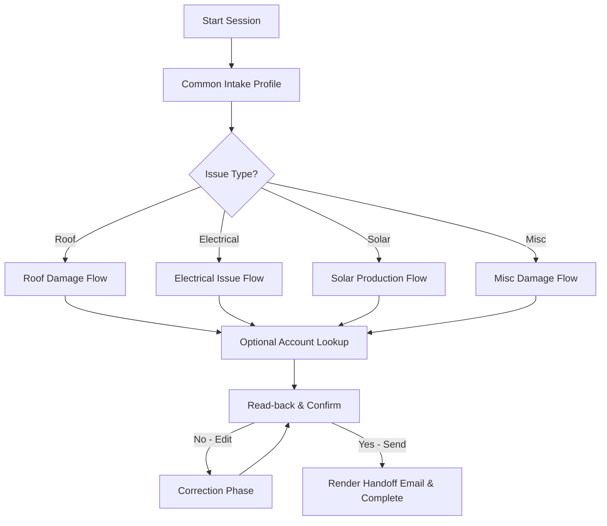

# Zeo Energy Service Chatbot — Conversational Flows Documentation

This document outlines the end-to-end conversational flows, branching logic, validation rules, security controls, and handoff mechanics implemented in the Zeo Energy chatbot application.

---

## Conversational Flow Architecture

The chatbot utilizes a hybrid system where **FastAPI orchestrates requests**, a **deterministic Python state machine owns the conversational logic and slot tracking**, and an **isolated local LLM extracts structured field data** from user responses.

---

## 1. Common Intake Profile (Initial Slots)

Regardless of the problem, every conversation starts by gathering standard profile information.

| Step Key | Field Type | Question / Prompt | Required | Details / Behaviors |
| :--- | :--- | :--- | :--- | :--- |
| `name` | `text` | *First, what's your full name?* | **Yes** | Used as an identity factor for account lookups. |
| `address` | `text` | *What's the service address (the home this is about)?* | **Yes** | Used as an identity factor for account lookups. |
| `email` | `email` | *What's the best email to reach you at? (You can say 'skip'.)* | No | Parsed using regex and LLM patterns. Skip keyword allowed. |
| `issue_type` | `enum` | *What type of issue are you experiencing?* | **Yes** | Options: `roof`, `electrical`, `solar`, `misc`. Determines the branch. |
| `urgency` | `int_1_10` | *On a scale of 1–10, how urgent is this?* | **Yes** | Constrained to numbers 1–10. Sets the priority tier on the email. |
| `third_parties` | `text` | *Have you contacted any third parties about this? (You can say 'skip'.)* | No | Records insurance details or other contractors. |

---

## 2. Issue-Specific Branching

Once the common profile is collected, the state machine dynamically appends branch-specific steps depending on `issue_type`.

### Flow A: Roof Damage Branch (`roof`)
Routinely used for roof leaks, damage from wind, or panel mounting issues.

1. **Roof Type** (`roof_type` · `enum`): *What type of roof does your home have?* 
   * Options: `shingle`, `tile`, `metal`, `flat`
2. **Leaking Status** (`leaking` · `yesno` · **Required**): *Is your roof actively leaking?*
3. **Leak Timing** (`first_noticed` · `text`): *When did you first notice the leak?*
   * *Gated:* Only asked if `leaking == True`.
4. **Pre-Existing Damage** (`pre_existing` · `yesno`): *Was there any pre-existing damage to your roof?*
5. **Attic Access** (`attic_accessible` · `yesno`): *Is your attic accessible?*
6. **Location Details** (`location` · `text`): *Where on the roof is the problem? (e.g. front-left slope near chimney)*
7. **Narrative Description** (`description` · `text` · **Required**): *Please describe the problem in your own words.*
   * *Verbatim:* Logged directly into the case handoff verbatim field.
8. **Photo Attachment** (`_photos` · `text`): *If you have photos of the roof damage, upload them now — or type 'skip'.*
   * *Upload:* Opens the file upload dialog on the UI.

---

### Flow B: Electrical Branch (`electrical`)
Captures issues with power outages, breaker problems, or electrical safety.

1. **Power Outage Status** (`without_power` · `yesno` · **Required**): *Are you currently without power?*
   * *Safety Trigger:* If `without_power == True`, flags a high-priority safety alert on the email header.
2. **Tripped Breakers** (`breakers_tripped` · `yesno`): *Have any circuit breakers in your electrical box tripped? (Check your electrical panel box to see if any switches are flipped to OFF or stuck in the middle between ON and OFF, sometimes showing red or orange.)*
3. **Neighbors Without Power** (`neighbors_without_power` · `yesno`): *Are you aware of any other houses around you being without power?*
4. **Storm Activity** (`recent_storm` · `yesno`): *Was there a recent storm or lightning strike in your area?*
5. **Affected Areas** (`affected_areas` · `text`): *Which areas of the home are affected?*
6. **Narrative Description** (`description` · `text` · **Required**): *Please describe the electrical problem in your own words.*
   * *Verbatim:* Logged into the case handoff verbatim field.
7. **Photo Attachment** (`_photos` · `text`): *If you have photos related to the electrical issue, upload them now — or type 'skip'.*

---

### Flow C: Solar Production Branch (`solar`)
Addresses low system output or inverter issues. Contains an automated policy deflection banner.

> [!NOTE]
> **Solar Deflection Policy:** Upon entering the solar branch description, the bot displays a deflection notice explaining that production history takes about a year of data to evaluate, and displays contact details for the performance team to encourage rapid manual resolution, while continuing to log details.

1. **System Status** (`solar_status` · `enum`): *Is the solar system completely offline, producing less than usual, or physically damaged?*
   * Options: `completely_off`, `low_production`, `physical_damage`
2. **Inverter Error Code** (`inverter_error_code` · `text`): *Do you see any error code or warning light on your solar inverter? (Type 'none' or 'skip' if unsure.)*
3. **Narrative Description** (`description` · `text` · **Required**): *Please describe what you're seeing with your system's production.*
   * *Verbatim:* Logged into the case handoff verbatim field.
4. **Callback Request** (`callback_requested` · `yesno`): *Would you like a callback from our performance team?*
5. **Callback Information** (`callback_info` · `text`): *What's the best number and time to reach you?*
   * *Gated:* Only asked if `callback_requested == True`.
6. **Photo Attachment** (`_photos` · `text`): *If you have photos of the solar inverter or panels, upload them now — or type 'skip'.*

---

### Flow D: Miscellaneous Branch (`misc`)
Handles general issues like structural damage, physical collisions, or miscellaneous inquiries.

1. **Damage Object** (`what_damaged` · `text` · **Required**): *What is damaged?*
   * *Verbatim:* Logged into the case handoff verbatim field.
2. **Damage Cause** (`cause_of_damage` · `text`): *What caused the damage? (e.g. wind, fallen tree, vandalism)*
3. **Location Details** (`location` · `text`): *Where is the problem located? (You can say 'skip'.)*
4. **Additional Details** (`additional_details` · `text`): *Any additional details you'd like to add? (You can say 'skip'.)*
   * *Verbatim:* Logged into the case handoff verbatim field.
5. **Photo Attachment** (`_photos` · `text`): *If you have photos of the damage, upload them now — or type 'skip'.*

---

## 3. Dynamic Interceptors & Safety Triggers

The bot scans incoming messages in real-time on every turn using deterministic keyword interceptors.

### A. Deterministic 911 Safety Check
Runs prior to LLM parsing. If keywords like *fire, smoke, gas leak, natural gas, shock, live wire, explosion, emergency, or 911* are matched:
1. The bot displays a persistent red emergency warning:
   > ⚠️ **If there is any threat of harm to you or anyone at your home, please call 911 now.** I can't contact emergency services for you — please dial 911 directly if anyone is in danger.
2. The current intake flow is paused, preventing further state progression until the user acknowledges they are safe.

### B. Representative / Handoff Routing
If a user requests a human (matching terms like *representative, agent, human, talk to someone, phone number, support*):
1. The session is closed and marked `done = True`.
2. The user is directed to the appropriate phone support line based on their active issue:
   * **Solar Issues:** Call Service Department at `727-349-4057`.
   * **Electrical & Home Damage Issues (Roof / Misc):** Call Nonstandard Department at `727-382-0075`.
   * **Unknown Issue:** Displays both phone options categorized by department.

---

## 4. Verification & Account Lookup Mode

When the chatbot is configured in **Account Lookup Mode**, it runs a strict multi-factor verification check before the confirmation phase.

* **Multi-Factor Rule:** Verification requires matching the user's `Name` AND at least one other factor (`Address` OR `Email`). Single-factor query matches (e.g. matching just a name) are rejected to prevent customer enumeration attacks.
* **Match Behavior:** If verified, the matched customer details (Account #, system size, install date) are attached to the case context.
* **No-Match Behavior:** If no match occurs, the request is flagged as "unverified" for manual staff follow-up. The bot never reveals which fields were close, preventing unauthorized probing.

---

## 5. Review & Email Generation (Handoff)

After slot collection and verification, the state machine enters the **Confirmation & Read-back Phase**.

1. **Read-back Summary:** The bot compiles all collected details into a structured, readable list and asks: *Should I send this to our service team?*
2. **Correction Loop:** If the user selects "No, change something", the state machine moves to the `correct` phase, accepting any text description of the changes (which are stored under `[Correction]`), and displays the updated summary for validation.
3. **Email Render & Storage:** Once confirmed:
   * Urgency urgency level determines the priority tag (`HIGH PRIORITY` for urgency $\ge 8$ or power outages, `Elevated` for urgency $\ge 5$, `Standard` otherwise).
   * Jinja2 compiles the handoff email from a structured HTML template with **HTML autoescape forced** to prevent XSS.
   * The generated email is stored in `backend/data/emails.json` and loaded into the **Emails** staff-facing dashboard.
